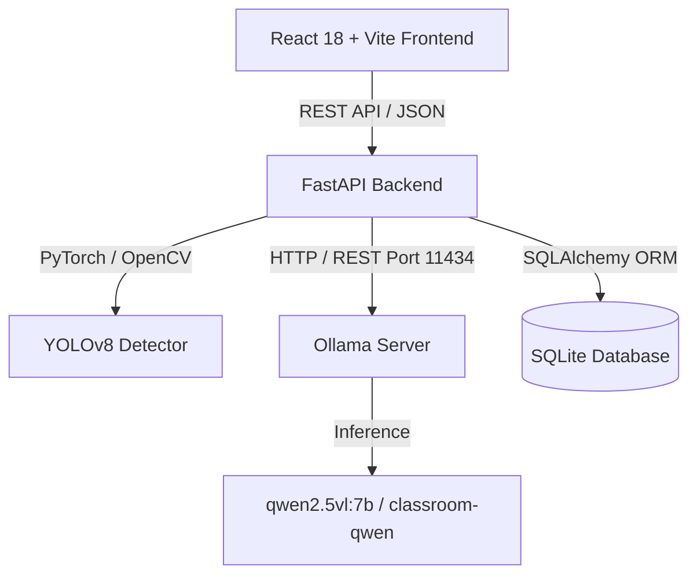
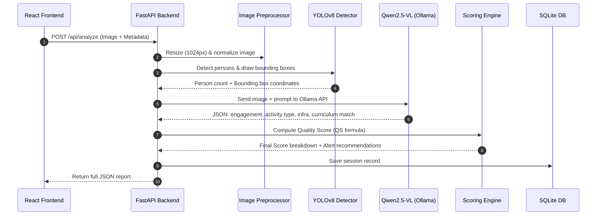

# Classroom Quality Monitoring System — Complete Technical Documentation

> **AI-Powered Automated Inspection & Quality Scoring System**  
> *Built for Skill Development & Vocational Training Institutes (NSDC / NSTI)*

---

## 📋 Table of Contents
1. [Executive Summary](#1-executive-summary)
2. [Tech Stack & Architecture Overview](#2-tech-stack--architecture-overview)
3. [Quality Score (QS) Mathematical Model](#3-quality-score-qs-mathematical-model)
4. [End-to-End Image Analysis Pipeline](#4-end-to-end-image-analysis-pipeline)
5. [Backend Architecture & API Reference](#5-backend-architecture--api-reference)
6. [Frontend Architecture & Component Layout](#6-frontend-architecture--component-layout)
7. [Database Schema & Data Persistence](#7-database-schema--data-persistence)
8. [Fine-Tuning & Ollama Customization](#8-fine-tuning--ollama-customization)
9. [Installation & Developer Setup Guide](#9-installation--developer-setup-guide)
10. [Directory & File Reference](#10-directory--file-reference)

---

## 1. Executive Summary

The **Classroom Quality Monitoring System** is an end-to-end AI platform designed to automate quality compliance and session inspection across vocational training centers (such as NSDC and NSTI institutes). 

By analyzing classroom surveillance or inspection images, the system combines **YOLOv8** object detection (for fast, objective person and object counts) and **Qwen2.5-VL-7B** vision-language models (via Ollama) to compute a multi-factor **Quality Score (QS)** ranging from 0 to 100.

### Key Capabilities
- **Automated Attendance Verification:** Detects total headcount vs registered student enrollment.
- **Trainer Activity Tracking:** Verifies trainer presence, standing/teaching posture, and active engagement.
- **Student Engagement Assessment:** Evaluates focus, posture, and active participation.
- **Infrastructure Verification:** Checks for required equipment (projector, computer lab, whiteboard, safety gear).
- **Curriculum Compliance:** Cross-references observed activity against planned lesson plans.
- **Real-Time Analytics Dashboard:** Displays institutional trends, risk alerts, radar charts, and audit histories.

---

## 2. Tech Stack & Architecture Overview



### Stack Components

| Layer | Technology | Function |
| :--- | :--- | :--- |
| **Frontend** | React 18, Vite, Tailwind CSS, Lucide React, Recharts | Interactive web app, real-time metrics, radar charts, inspection history |
| **Backend API** | FastAPI, Python 3.10+, Pydantic v2, Uvicorn | RESTful API endpoints, request validation, async execution |
| **Object Detection** | Ultralytics YOLOv8 (`yolov8n.pt`) | Person detection, student count, trainer localization, bounding box overlays |
| **Vision-Language AI** | Qwen2.5-VL-7B via Ollama (`classroom-qwen:latest`) | Qualitative analysis: engagement posture, curriculum match, infrastructure |
| **Database** | SQLite, SQLAlchemy ORM | Session records, institution aggregated metrics, inspection logs |

---

## 3. Quality Score (QS) Mathematical Model

The Quality Score is calculated using a weighted multi-variable linear model:

$$\text{QS} = (0.25 \times \text{TP}) + (0.20 \times \text{SE}) + (0.20 \times \text{CA}) + (0.10 \times \text{IN}) + (0.15 \times \text{AT}) + (0.10 \times \text{CC})$$

### Variable Breakdown & Scoring Rules

| Metric | Symbol | Weight | Scoring Matrix / Calculation |
| :--- | :--- | :--- | :--- |
| **Trainer Presence** | `TP` | 25% | • `teaching`: **100**<br>• `present_inactive`: **70**<br>• `absent`: **0** |
| **Student Engagement** | `SE` | 20% | Scale 0–100 derived from posture, gaze direction, and active participation |
| **Classroom Activity** | `CA` | 20% | • `practical_session`: **100**<br>• `theory_lecture`: **90**<br>• `group_discussion`: **85**<br>• `self_study`: **70**<br>• `disrupted`: **0** |
| **Infrastructure** | `IN` | 10% | $\frac{\text{Visible Infrastructure Items}}{\text{Expected Items}} \times 100$ |
| **Attendance Ratio** | `AT` | 15% | $\min\left(100, \frac{\text{Detected Students}}{\text{Registered Students}} \times 100\right)$ |
| **Curriculum Compliance** | `CC` | 10% | • `fully_matched`: **100**<br>• `partially_matched`: **60**<br>• `unmatched`: **20** |

### Quality Score Bands

| Range | Score Label | System Action / Severity |
| :--- | :--- | :--- |
| **90 – 100** | 🟢 Excellent Training | Compliant; High performance badge |
| **80 – 89.99** | 🟢 Good Training | Compliant session |
| **70 – 79.99** | 🟡 Average Training | Satisfactory compliance |
| **60 – 69.99** | 🟠 Needs Improvement | Minor flag generated for institution |
| **40 – 59.99** | 🔴 Enhanced Monitoring Required | Risk alert sent to inspector dashboard |
| **0 – 39.99** | ⛔ Manual Inspection Required | Immediate automated audit trigger |

---

## 4. End-to-End Image Analysis Pipeline

When an inspector uploads a classroom photo via the frontend UI, the backend executes a 5-stage pipeline:



1. **Preprocessing (`image_preprocessor.py`):** Resizes images to max 1024px while maintaining aspect ratio, corrects EXIF orientation, and converts to standard RGB.
2. **Object Detection (`yolo_model.py`):** Runs YOLOv8 to detect all `person` objects, determining total detected student count and bounding box overlays.
3. **Qualitative Inference (`qwen_model.py`):** Passes image to Ollama REST API (`classroom-qwen:latest`) with strict JSON schema instructions to assess qualitative parameters.
4. **Score Calculation (`scoring.py`):** Synthesizes YOLO numerical counts and Qwen qualitative observations into the weighted Quality Score formula.
5. **Data Persistence (`crud.py`):** Saves complete analysis details, timestamp, score breakdown, and alerts to SQLite.

---

## 5. Backend Architecture & API Reference

### Core Modules
- **`backend/main.py`**: FastAPI entry point, lifecycle manager (DB init, model pre-loading), CORS configuration.
- **`backend/config.py`**: Configuration constants, weights, thresholds, and Ollama REST host bindings.
- **`backend/api/routes.py`**: REST endpoint handlers.
- **`backend/api/schemas.py`**: Pydantic v2 request/response validation contracts.

### Main REST Endpoints

#### `POST /api/analyze`
Submits a classroom image and metadata for full analysis.

- **Content-Type:** `multipart/form-data`
- **Form Parameters:**
  - `image` (file, required): JPG/PNG classroom photo.
  - `institution_name` (string): e.g., "NSTI Bangalore".
  - `course_name` (string): e.g., "Python Programming".
  - `registered_students` (int): Total enrolled students.
  - `planned_activity` (string): Expected session task.
  - `infrastructure_items` (JSON string list): e.g., `["projector", "whiteboard"]`.

#### `GET /api/sessions`
Retrieves a paginated list of all historical inspection sessions.

#### `GET /api/sessions/{session_id}`
Returns details for a specific inspection session.

#### `GET /api/institutions/{institution_name}/summary`
Generates aggregated performance stats, average Quality Score, total sessions, and risk alerts for a specific institution.

#### `GET /api/health`
Health check verifying database connection and Ollama model availability.

---

## 6. Frontend Architecture & Component Layout

Built with **React 18** and **Vite**, utilizing a clean modular component hierarchy and Tailwind CSS for modern dark-mode aesthetics.

### Page Hierarchy
- **`DashboardPage.jsx`**: Global oversight dashboard presenting total sessions analyzed, average quality score, high-performing vs flagged institutions, and recent inspection cards.
- **`AnalyzePage.jsx`**: Main inspection workbench. Provides file upload with drag-and-drop, metadata inputs (course name, student count, activity type), real-time loading state, and comprehensive result views.
- **`InstitutionDetailsPage.jsx`**: Institution-specific performance dashboard showing historical trend lines, score distribution, and audit logs.
- **`HistoryPage.jsx`**: Searchable, filterable list of all previous inspection reports.

### Primary Reusable Components
- **`ScoreGauge.jsx`**: Radial/circular gauge showing final Quality Score with color-coded score bands.
- **`QualityRadarChart.jsx`**: Multi-axis radar chart (via Recharts) displaying 6-factor score breakdowns.
- **`AnalysisBanner.jsx`**: Quick compliance alert banner displaying pass/fail indicators and system recommendations.

---

## 7. Database Schema & Data Persistence

The backend utilizes **SQLite** managed via **SQLAlchemy ORM**.

### Table: `analysis_sessions`

| Column | Type | Description |
| :--- | :--- | :--- |
| `id` | Integer (PK) | Auto-incrementing primary key |
| `session_id` | String(64) | Unique session identifier (e.g., `SESSION-A1B2C3D4`) |
| `timestamp` | DateTime | Inspection timestamp |
| `institution_name` | String(128) | Name of training institute |
| `course_name` | String(128) | Title of training course |
| `job_role` | String(128) | Associated job role / trade |
| `registered_students`| Integer | Total enrolled headcount |
| `detected_students`  | Integer | Headcount identified by YOLOv8 |
| `quality_score` | Float | Calculated final Quality Score (0–100) |
| `quality_label` | String(64) | Score category label |
| `trainer_present` | Boolean | True if trainer detected |
| `trainer_status` | String(64) | `teaching`, `present_inactive`, or `absent` |
| `engagement_score` | Float | Student engagement rating |
| `curriculum_match` | String(64) | `fully_matched`, `partially_matched`, `unmatched` |
| `score_breakdown` | JSON | 6-factor score values |
| `alerts` | JSON | List of generated warnings and recommendations |
| `raw_image_path` | String(256) | File location of uploaded inspection image |

---

## 8. Fine-Tuning & Ollama Customization

The system provides two tiers of fine-tuning for **Qwen2.5-VL-7B**:

### Option A: Ollama System Prompt Customization (`Modelfile`)
Creates a customized model `classroom-qwen` tailored specifically for structured JSON outputs:

```dockerfile
FROM qwen2.5vl:7b
PARAMETER temperature 0
PARAMETER num_predict 512
SYSTEM """You are an AI classroom quality analyst for a government skill development training program... Always respond ONLY with valid JSON."""
```
Build command:
```powershell
ollama create classroom-qwen -f backend/fine_tuning/Modelfile
```

### Option B: Full QLoRA Weight Fine-Tuning
For advanced domain adaptation using HuggingFace `peft` and `TRL`:
1. `prepare_dataset.py`: Converts annotated images and `labels.json` into ShareGPT visual dialogue format.
2. `finetune_qwen.py`: Executes QLoRA training using 4-bit quantization (BitsAndBytes).
3. `merge_lora.py`: Merges LoRA adapters back into base weights for GGUF export.

---

## 9. Installation & Developer Setup Guide

### Step 1: Clone & Setup Python Environment
```powershell
# Navigate to project root
cd "D:\new volume e\PROJECTS\MINI_PROJECT"

# Create and activate virtual environment
python -m venv venv
.\venv\Scripts\Activate.ps1
```

### Step 2: Install Backend Dependencies
```powershell
# Install PyTorch (CUDA version recommended for NVIDIA GPU)
pip install torch torchvision --index-url https://download.pytorch.org/whl/cu121

# Install requirements
pip install -r backend/requirements.txt
```

### Step 3: Install & Start Ollama
1. Download Ollama from [ollama.com](https://ollama.com).
2. Pull Qwen2.5-VL model:
   ```powershell
   ollama pull qwen2.5vl:7b
   ```
3. Build the custom model:
   ```powershell
   ollama create classroom-qwen -f backend/fine_tuning/Modelfile
   ```

### Step 4: Launch Backend Server
```powershell
python -m backend.main
```
> API will run at **http://localhost:8000** (Swagger documentation at **/docs**).

### Step 5: Install & Launch Frontend Server
```powershell
# In a new terminal window:
cd frontend
npm install
npm run dev
```
> Web UI will run at **http://localhost:5173/**.

---

## 10. Directory & File Reference

```
MINI_PROJECT/
├── README.md                           ← Basic project quick-start
├── PROJECT_DOCUMENTATION.md            ← Full architectural documentation
├── sample_classroom.png                ← Sample test inspection image
├── classroom_monitoring.db             ← SQLite database file
├── backend/
│   ├── main.py                         ← FastAPI application entry point
│   ├── config.py                       ← Configurations, weights, and endpoints
│   ├── requirements.txt                ← Python package dependencies
│   ├── api/
│   │   ├── routes.py                   ← REST API routes
│   │   └── schemas.py                  ← Pydantic request/response models
│   ├── database/
│   │   ├── db.py                       ← Database engine & ORM setup
│   │   └── crud.py                     ← Database CRUD functions
│   ├── models/
│   │   ├── qwen_model.py               ← Ollama API client for Qwen2.5-VL
│   │   ├── yolo_model.py               ← YOLOv8 object detector wrapper
│   │   └── scoring.py                  ← Quality Score formula implementation
│   ├── services/
│   │   ├── image_preprocessor.py       ← Image optimization & resizing
│   │   └── analysis_pipeline.py        ← Pipeline orchestrator
│   └── fine_tuning/
│       ├── Modelfile                   ← Custom Ollama model specification
│       ├── prepare_dataset.py          ← ShareGPT dataset preparation
│       ├── finetune_qwen.py            ← QLoRA HuggingFace training script
│       ├── merge_lora.py               ← Adapter merging tool
│       └── README.md                   ← Fine-tuning instructions
└── frontend/
    ├── index.html                      ← HTML shell
    ├── package.json                    ← Node.js dependencies & scripts
    ├── vite.config.js                  ← Vite build configuration
    ├── tailwind.config.js              ← Tailwind CSS theme configuration
    └── src/
        ├── App.jsx                     ← Main application wrapper & router
        ├── main.jsx                    ← React entry point
        ├── index.css                   ← Design system & global styles
        ├── api/
        │   └── client.js               ← Axios API client wrapper
        ├── context/
        │   └── AnalysisContext.jsx     ← Global state management
        ├── pages/
        │   ├── DashboardPage.jsx       ← Main overview dashboard
        │   ├── AnalyzePage.jsx         ← Image upload & analysis workbench
        │   ├── HistoryPage.jsx         ← Session history audit log
        │   └── InstitutionDetailsPage.jsx ← Per-institution metrics page
        └── components/
            ├── Navbar.jsx              ← Top navigation bar
            ├── Footer.jsx              ← Bottom footer
            ├── ScoreGauge.jsx          ← Circular score visualization
            ├── QualityRadarChart.jsx   ← Recharts 6-factor radar chart
            ├── AnalysisBanner.jsx      ← Risk alert banner
            └── ErrorBoundary.jsx       ← UI error fallback handler
```
